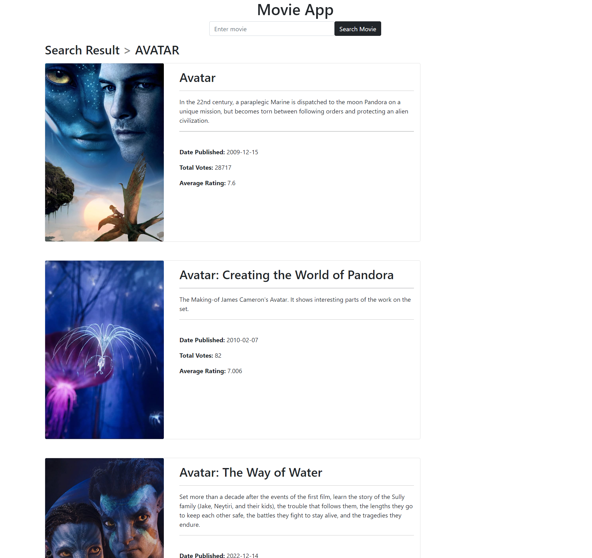

# moviesNPM

## General Info
Easy-to-use application to search a movie's information by inputting it's name in the search bar.



## Setup

### Node Installation
Go to [Official Node.js Website](https://nodejs.org) and download the installer.

### Run
After node is installed, install the modules by running the following commands in the terminal to install package dependencies.
```
npm install express morgan axios ejs
```
The application will start by running the following in the command line.
```
node index.js
```
The port will be on <b>localhost:3000</b>

## Technologies
The application uses axios and takes the responses from [themoviedb.org](https://www.themoviedb.org/) API and generates database to the inquired data.

Used bootstrap, node.js, javascript and EJS.